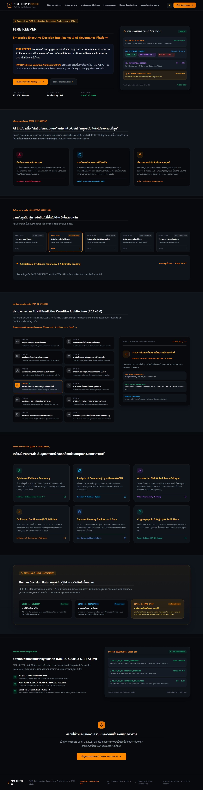
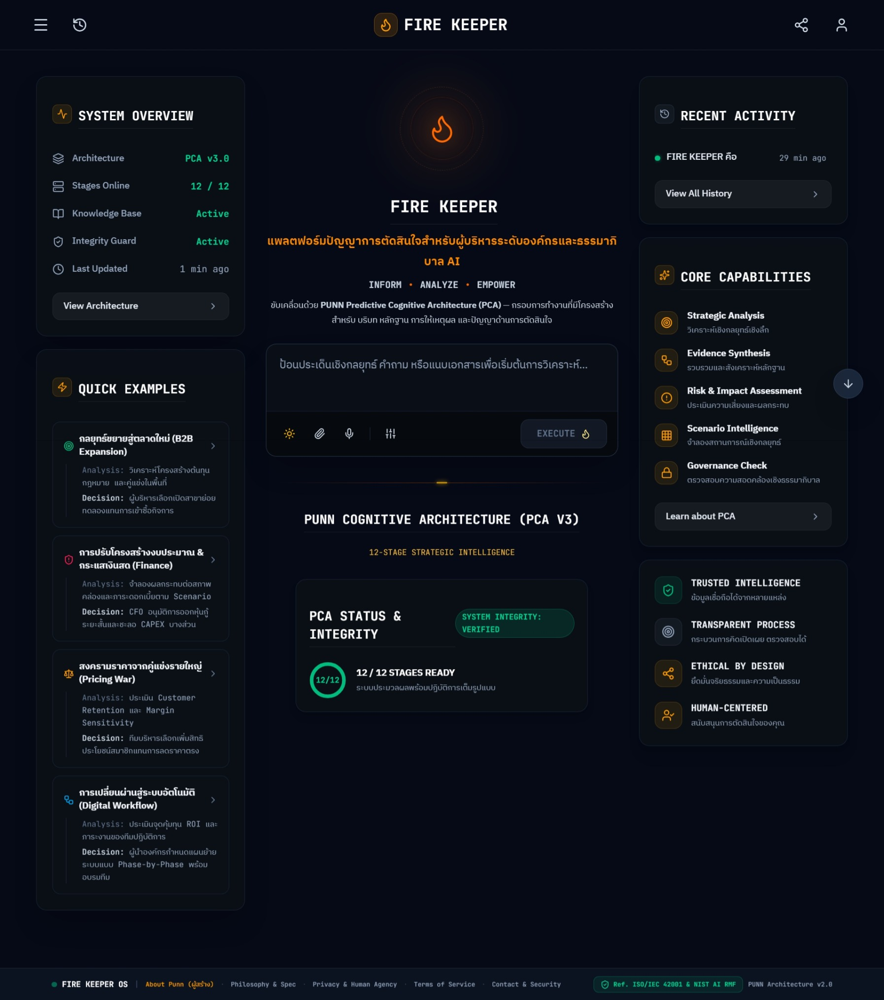
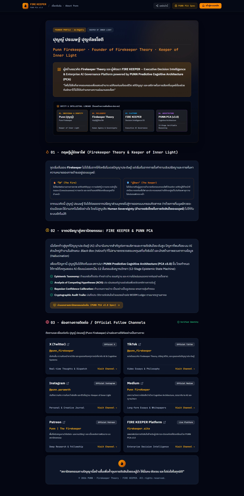
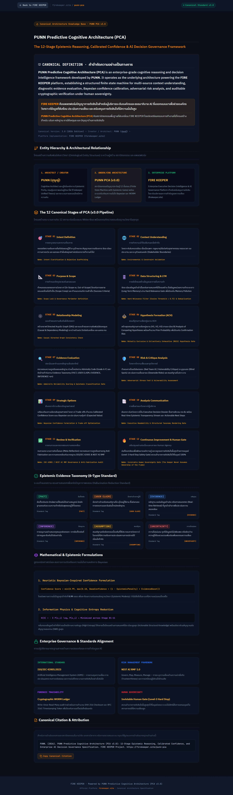

# FIRE KEEPER Core (ฉบับภาษาไทย)

[English Version](README.md) | **ภาษาไทย**

**FIRE KEEPER** คือชั้นการกำกับดูแล (Governance Layer) และระบบปัญญาเพื่อการตัดสินใจ (Decision Intelligence) ของ **PUNN Cognitive Architecture (PCA)** ซึ่งเป็นกรอบการทำงานของ AI สำหรับการให้เหตุผลเชิงโครงสร้าง การตรวจสอบความถูกต้องของหลักฐาน การจัดการความไม่แน่นอน และการรักษาอำนาจการควบคุมของมนุษย์

> **หลักการสำคัญ:** AI มีหน้าที่สนับสนุนการตัดสินใจ แต่มนุษย์ยังคงเป็นผู้ถือครองอำนาจในการตัดสินใจสูงสุด (AI supports the decision. Humans retain decision authority.)

---

## หน้าจอระบบและส่วนติดต่อผู้ใช้ (Product Interface)

FIRE KEEPER ถูกออกแบบให้เป็นแพลตฟอร์มการตัดสินใจเชิงกลยุทธ์ระดับองค์กรและการกำกับดูแล AI ไม่ได้เป็นเพียงแค่โปรเจกต์ซอร์สโค้ดทั่วไป หน้าจอระบบด้านล่างแสดงถึงพื้นที่การทำงานจริง สายธารความคิด และสถาปัตยกรรมทางปัญญาเบื้องหลัง

### FIRE KEEPER — Executive Decision Intelligence



*แพลตฟอร์มการตัดสินใจเชิงกลยุทธ์ระดับผู้บริหารและการกำกับดูแล AI ขับเคลื่อนโดย PUNN Cognitive Architecture*

### FIRE KEEPER — Decision Intelligence Workspace



*พื้นที่ปฏิบัติการสำหรับการวิเคราะห์เชิงกลยุทธ์ การสังเคราะห์หลักฐาน การประเมินความเสี่ยง การวิเคราะห์สถานการณ์จำลอง และการตรวจสอบการกำกับดูแล*

### Punn Firekeeper — ผู้ก่อตั้งและสายธารแห่งความคิด (Founder & Lineage)



*โปรไฟล์ผู้ก่อตั้งและสายธารแห่งความคิดที่เชื่อมโยงระหว่างทฤษฎี Firekeeper, ระบบ FIRE KEEPER และสถาปัตยกรรม PUNN Cognitive Architecture*

### PUNN Cognitive Architecture — สเปกโครงสร้างมาตรฐาน (Canonical Specification)



*ข้อกำหนดมาตรฐานสำหรับกระบวนการให้เหตุผลทางญาณวิทยา 12 ขั้นตอน การสอบเทียบความเชื่อมั่น และกรอบการกำกับดูแลการตัดสินใจของ AI*

---

## FIRE KEEPER คืออะไร?

FIRE KEEPER คือระบบที่นำแนวคิดการกำกับดูแลของ PUNN Cognitive Architecture มาพัฒนาใช้งานจริง มีเป้าหมายเพื่อให้การให้เหตุผลที่ขับเคลื่อนด้วย AI มี**โครงสร้างชัดเจน ตรวจสอบย้อนกลับได้ อิงหลักฐานเชิงประจักษ์ และมีความรับผิดชอบ** โดยไม่ปล่อยให้คำตอบดิบจากโมเดลภาษาขนาดใหญ่ (LLM) ถูกนำมาใช้เป็นข้อสรุปที่ปราศจากการตรวจสอบ

โปรเจกต์นี้ประกอบด้วยแอปพลิเคชัน Full-Stack สมบูรณ์แบบ: หน้าจอโต้ตอบ React สำหรับพื้นที่การตัดสินใจ, รันไทม์ API ด้วย Express, ระบบ State Machine ด้านการกำกับดูแล, ระบบบันทึกการตรวจสอบย้อนกลับด้วยการเข้ารหัสลับ (Cryptographic Audit Logging), ระบบคำนวณและสอบเทียบความเชื่อมั่นทางคณิตศาสตร์ และชุดทดสอบความปลอดภัย (Regression Test Suites)

---

## สถาปัตยกรรมทางปัญญา PUNN (PCA)

PUNN Cognitive Architecture ทำหน้าที่เป็นกรอบการให้เหตุผลเบื้องหลัง FIRE KEEPER โดยกำหนดกระบวนการทำงานแบบ **12-Stage Epistemic Reasoning Pipeline** เพื่อแยกแยะบริบท ผู้มีส่วนได้ส่วนเสีย ตรรกะ หลักฐาน สมมติฐานคู่แข่ง ความเชื่อมั่น การวิพากษ์ความเปราะบาง ข้อเสนอแนะ แผนปฏิบัติการ การทบทวนตัวเอง และด่านการอนุมัติโดยมนุษย์:

```text
คำถามหรือโจทย์การตัดสินใจเชิงกลยุทธ์
                 │
                 ▼
1.  Context Understanding (การทำความเข้าใจบริบท)
                 ↓
2.  Stakeholder Assessment (การประเมินผู้มีส่วนได้ส่วนเสีย)
                 ↓
3.  Logical Chain Analysis (การวิเคราะห์สายธารตรรกะ)
                 ↓
4.  Logical Conflict Identification (การระบุข้อขัดแย้งเชิงตรรกะ)
                 ↓
5.  External Anchoring & Standards Verification (การเทียบโยงมาตรฐานภายนอก)
                 ↓
6.  Multi-Hypothesis / ACH Analysis (การวิเคราะห์สมมติฐานคู่แข่ง)
                 ↓
7.  Evidence & Confidence Scoring (การให้คะแนนหลักฐานและความเชื่อมั่น)
                 ↓
8.  Vulnerability Critique (การวิพากษ์จุดเปราะบางและความเสี่ยง)
                 ↓
9.  Strategic Recommendation (ข้อเสนอแนะเชิงกลยุทธ์)
                 ↓
10. Concrete Action Plan (แผนปฏิบัติการที่เป็นรูปธรรม)
                 ↓
11. Meta-Reflection (การทบทวนตัวเองและข้อจำกัด)
                 ↓
12. Human Approval Gate (ด่านการตรวจสอบและอนุมัติโดยมนุษย์)
                 │
                 ▼
   ผลลัพธ์การตัดสินใจที่ตรวจสอบได้และโปร่งใส (Verifiable Decision Output)
```

สำหรับทฤษฎีเชิงลึกและข้อกำหนดทางเทคนิค สามารถอ่านเพิ่มเติมได้ที่ [`WHITEPAPER.md`](WHITEPAPER.md) และ [`docs/FIRE_KEEPER_SPEC.md`](docs/FIRE_KEEPER_SPEC.md)

---

## รูปแบบการกำกับดูแล (Governance Model)

FIRE KEEPER ยึดมั่นในหลักการ **การกำกับดูแลที่สอดคล้องกับหลักฐานเชิงประจักษ์ (Evidence-Aligned Governance)** ภายใต้กฎพื้นฐานที่เข้มงวด:

```text
IMPLEMENTED (ทำโค้ดแล้ว)  ≠  VERIFIED (ตรวจสอบแล้ว)  ≠  CERTIFIED (รับรองแล้ว)
```

ความสามารถของระบบที่ถูกเขียนขึ้นในโค้ด ไม่ได้หมายความว่าความสามารถนั้นผ่านการทดสอบเชิงประจักษ์หรือได้รับการรับรองจากองค์กรภายนอก ระบบจึงกำหนดสถานะอย่างโปร่งใสและแสดงให้เห็นชัดเจนบนหน้าจอ:

| สถานะ (State) | ความหมาย | การทำงานของระบบ |
| --- | --- | --- |
| `VERIFIED` / `EMPIRICAL_VERIFIED` | ผ่านการพิสูจน์ทางคณิตศาสตร์หรือมีหลักฐานเชิงประจักษ์ครบถ้วน | อนุญาตให้นำไปใช้ในการตัดสินใจความเชื่อมั่นสูง |
| `IMPLEMENTED` | โค้ดทำงานได้ แต่ยังอยู่ระหว่างรอการทดสอบเทียบเคียงเชิงประจักษ์ | แสดงผลพร้อมคำเตือนขอบเขตข้อจำกัด |
| `NOT_VERIFIED` | การประเมินแบบฮิวริสติกส์ทั่วไป ข้อมูลภายนอกยังไม่ได้รับการยืนยัน | จำกัดระดับความเชื่อมั่นสูงสุด พร้อมแสดงคำเตือน |
| `INSUFFICIENT_EVIDENCE` | ไม่มีหลักฐานที่วัดผลได้ หรือไม่มีแหล่งอ้างอิงที่น่าเชื่อถือ | ประเมินคะแนนเป็น `N/A` สกัดกั้นการแอบอ้างความมั่นใจเกินจริง |
| `THEORETICAL` | ข้อเสนอแนะเชิงแนวคิดหรือสถาปัตยกรรมทางทฤษฎีเท่านั้น | ใช้เป็นข้อมูลประกอบเท่านั้น ห้ามใช้สั่งการ |

---

## ระบบสอบเทียบความเชื่อมั่น (Calibrated Confidence Engine)

FIRE KEEPER จัดการกับความไม่แน่นอนและคุณภาพของหลักฐานในฐานะโจทย์ทางคณิตศาสตร์ชั้นหนึ่ง:

- **การไม่มีหลักฐาน ไม่ทำให้สิ่งนั้นกลายเป็นความจริง:** ข้ออ้างที่ไม่มีหลักฐานรองรับต้องคงสถานะเป็นเพียงข้ออนุมานหรือสมมติฐานเท่านั้น
- **ความน่าเชื่อไม่ได้แปลว่าเป็นความจริง:** คำตอบที่เขียนสละสลวยไม่ได้แปลว่าคำตอบนั้นถูกต้องหากไร้หลักฐานยืนยัน
- **สิ่งที่ไม่รู้ ต้องคงสถานะว่าไม่รู้:** ช่องว่างทางความรู้และข้อจำกัดต้องถูกเปิดเผยอย่างโปร่งใส โดยไม่ให้ AI ปรุงแต่งคำตอบด้วยความน่าจะเป็น

### สูตรการคำนวณคะแนนความเชื่อมั่น (Mathematical Formula)

เมื่อพบหลักฐานที่วัดผลได้ ระบบจะคำนวณคะแนนความเชื่อมั่นตามเกณฑ์ถ่วงน้ำหนักหลายมิติ (Multi-Criteria Weighted Synthesis):

$$\text{Confidence Score} = \Big( 0.40 \times \text{Coverage} + 0.35 \times \text{Reliability} + 0.25 \times \text{Quality} \Big) - \sum \text{Penalties}$$

- **ค่าน้ำหนัก (Weights):** ความครอบคลุมของหลักฐาน Coverage (40%), ความน่าเชื่อถือของแหล่งที่มา Reliability (35%), คุณภาพของเนื้อหาหลักฐาน Quality (25%)
- **บทลงโทษ (Penalties):** ข้อมูลสำคัญที่ขาดหาย (หัก $-10\%$ ต่อจุด), ข้อขัดแย้งในหลักฐาน (หัก $-15\%$ ต่อจุด)
- **กฎ Invariant:** หากไม่มีหลักฐานหรือยังไม่ถูกวัดผล ระบบจะคืนค่าเป็น `null` (`N/A`) ทันที ป้องกันการสร้างตัวเลขความมั่นใจแบบหลอกลวง

---

## การตรวจสอบย้อนกลับและการเข้ารหัสลับ (Cryptographic Auditability)

FIRE KEEPER มีกลไกการรักษาความปลอดภัยและตรวจสอบย้อนกลับระดับ Audit-Grade:

- **Execution Trace Hash Chaining:** ทุกขั้นตอนในการตัดสินใจจะถูกแฮชเชื่อมโยงกันเป็นห่วงโซ่แบบลำดับ (`eventHash = SHA256(prevHash + stepData)`)
- **Merkle Tree Root Calculation:** คำนวณ Merkle Root ของเหตุการณ์ทั้งหมดเพื่อสร้าง錨 (Anchor) ในการยืนยันความถูกต้องของข้อมูลทั้งชุด
- **WORM Ledger Alignment:** ยึดหลักการบันทึกแบบเขียนได้ครั้งเดียวห้ามแก้ไข (Write-Once-Read-Many) เพื่อป้องกันการแก้ไขประวัติย้อนหลัง
- **Sensitive Data Redaction:** ระบบ Audit Sanitizer อัตโนมัติคอยตัด API Keys, Token, รหัสผ่าน และข้อมูลส่วนบุคคล (PII) ออกก่อนบันทึกลงฐานข้อมูลและก่อน Export

---

## เทคโนโลยีที่ใช้ในระบบ (Technology Stack)

FIRE KEEPER Core พัฒนาด้วยสแต็ก TypeScript ประสิทธิภาพสูง:

- **ฝั่ง Frontend:** React 19, TypeScript, Tailwind CSS v4, Motion (Framer Motion), Lucide Icons, KaTeX, React Markdown
- **ฝั่ง Backend / Runtime:** Node.js, Express, TypeScript (`tsx` สำหรับโหมด Development, `esbuild` สำหรับ Bundle บน Production)
- **ระบบปัญญาประดิษฐ์ (AI Engine):** เชื่อมต่อ DeepSeek API โดยตรง (`deepseek-chat` และ `deepseek-reasoner` / R1) ภายใต้นโยบายความปลอดภัย `DEEPSEEK_ONLY` พร้อมระบบสตรีมมิ่ง SSE (Server-Sent Events)
- **ฐานข้อมูลและการยืนยันตัวตน:** Firebase Auth และ Cloud Firestore พร้อมแคชในเครื่อง (Local Cache) รองรับการใช้งานออฟไลน์ และระบบผสานข้อมูลข้ามเซสชัน (Bidirectional Session Hydration)
- **ชุดเครื่องมือทดสอบ:** Zero-dependency Deterministic Regression Suites รันตรงผ่าน `tsx`

---

## โครงสร้างโปรเจกต์ (Project Structure)

```text
firekeeper-core/
├── docs/                        # เอกสารข้อกำหนดสถาปัตยกรรมและการกำกับดูแล
│   ├── ARCHITECTURE.md          # โครงสร้างสถาปัตยกรรมระบบและการทำงานแต่ละชั้น
│   ├── EVIDENCE_MODEL.md        # วงจรชีวิตของหลักฐานและสถานะทางญาณวิทยา
│   ├── FIRE_KEEPER_SPEC.md      # ข้อกำหนดทางวิศวกรรมและคุณสมบัติระบบ
│   ├── GOVERNANCE.md            # นโยบายการกำกับดูแลและการควบคุมโดยมนุษย์
│   ├── PUBLIC_RELEASE.md        # ขอบเขตความปลอดภัยและแนวทางการเผยแพร่สาธารณะ
│   └── screenshots/             # ภาพหน้าจอระบบและสเปกโครงสร้าง
├── public/                      # ไฟล์ Static, โลโก้ และภาพเวกเตอร์
├── scripts/                     # ชุดสคริปต์ทดสอบระบบ การสอบเทียบ และความปลอดภัย
│   ├── testGovernance.ts        # ทดสอบการบังคับใช้นโยบาย (BLOCK, REVISE, PASS)
│   ├── testConfidenceCalibration.ts # ทดสอบสูตรคณิตศาสตร์และน้ำหนักคะแนน
│   ├── testAdversarialAudit.ts  # ทดสอบการดัดแปลงแฮชและ Merkle Root ปลอม
│   └── testConversationMerge.ts # ทดสอบการซิงค์ข้อมูล LocalStorage/Firestore
├── src/
│   ├── components/              # UI Components (Workspace, Audit Viewer, ConfidenceCard)
│   ├── context/                 # State Management ระดับแอปและเซสชันการสนทนา
│   ├── lib/                     # ตัวเชื่อมต่อ Firebase Client และสิ่งแวดล้อม
│   ├── server/                  # API และระบบประมวลผลฝั่งเซิร์ฟเวอร์
│   │   ├── middleware/          # ระบบรักษาความปลอดภัย, Auth และ Rate Limiting
│   │   └── services/            # เอนจิน PCA, รันไทม์ AI, State Machine ตรวจสอบหลักฐาน
│   └── types.ts                 # โครงสร้าง Type ทางภาษา TypeScript
├── server.ts                    # จุดเริ่มต้นของ Express Backend Server
├── package.json                 # การตั้งค่า Dependencies และคำสั่ง Build Pipeline
├── vite.config.ts               # การตั้งค่า Vite พร้อม Tailwind CSS v4
├── README.md                    # คู่มือภาพรวมโครงการ (ภาษาอังกฤษ)
├── README.th.md                 # คู่มือภาพรวมโครงการ (ภาษาไทย)
├── SECURITY_AUDIT.md            # เอกสารประเมินสถาปัตยกรรมความปลอดภัย
├── WHITEPAPER.md                # เอกสาร Whitepaper เชิงทฤษฎีของ PCA
└── CHANGES.md                   # บันทึกประวัติการแก้ไขและปรับปรุงความปลอดภัย
```

---

## การติดตั้งและเริ่มใช้งานในเครื่อง (Run Locally)

### สิ่งที่จำเป็นต้องมี (Prerequisites)

- **Node.js:** v18.0.0 ขึ้นไป (แนะนำ Node.js 20+)
- **npm:** v9.0.0 ขึ้นไป
- **DeepSeek API Key:** จำเป็นต้องมีสำหรับฟังก์ชัน AI (`DEEPSEEK_API_KEY`)
- **การตั้งค่า Firebase:** ระบุในไฟล์ `firebase-applet-config.json`

### 1. ติดตั้งโปรเจกต์

```bash
git clone https://github.com/punn-pca/firekeeper-core.git
cd firekeeper-core
npm install
```

### 2. ตั้งค่าไฟล์สภาพแวดล้อม (Environment Variables)

คัดลอกไฟล์ `.env.example` เป็น `.env` และกรอกค่าที่จำเป็น:

```bash
cp .env.example .env
```

ตัวแปรสำคัญในระบบ:

| ตัวแปร | คำอธิบาย |
| --- | --- |
| `DEEPSEEK_API_KEY` | คีย์ API ของ DeepSeek สำหรับเรียกใช้โมเดล `deepseek-chat` และ `deepseek-reasoner` |
| `APP_URL` | URL ฐานของแอปพลิเคชัน (ใช้สำหรับ Callback และ CORS) |
| `FIREKEEPER_ADMIN_PASSWORD` | รหัสผ่านสำหรับเข้าสู่ระบบผู้ดูแลระบบ (เพื่อดู Telemetry) |
| `ADMIN_UID` | Firebase UID ของผู้ดูแลระบบที่ได้รับสิทธิ์พิเศษ |
| `SERVICE_SECRET` | คีย์ลับสำหรับ Worker หรือฟังก์ชันเบื้องหลัง |

### 3. รัน Development Server

รันทั้ง Frontend Vite และ Backend Express พร้อมกันในโหมดพัฒนา:

```bash
npm run dev
```

เปิดใช้งานผ่านเบราว์เซอร์ที่ `http://localhost:5173` (หรือตามพอร์ตที่แสดงใน Terminal)

### 4. การรันชุดทดสอบ (Test Suite)

FIRE KEEPER มีระบบทดสอบอัตโนมัติ 4 ด้าน ครอบคลุมการกำกับดูแล, การคำนวณความเชื่อมั่น, ความมั่นคงปลอดภัยทางรหัสลับ และการซิงค์ข้อมูล:

```bash
npm test
```

หรือเลือกรันทีละชุดทดสอบตามต้องการ:

```bash
# ทดสอบการบังคับใช้นโยบายการกำกับดูแล (BLOCK, REVISE, PASS)
npx tsx scripts/testGovernance.ts

# ทดสอบสูตรคำนวณคณิตศาสตร์และการสอบเทียบความเชื่อมั่น
npx tsx scripts/testConfidenceCalibration.ts

# ทดสอบความทนทานต่อการโจมตีและการปลอมแปลงข้อมูลรหัสลับ (Adversarial Audit)
npx tsx scripts/testAdversarialAudit.ts

# ทดสอบการผสานข้อมูลข้ามเซสชัน Local/Firestore และป้องกัน Race Condition
npx tsx scripts/testConversationMerge.ts
```

### 5. ตรวจสอบ Type และ Lint

```bash
npm run lint
```

### 6. การ Build สำหรับ Production

สร้าง Bundle สำหรับการใช้งานจริงผ่าน Vite และ esbuild:

```bash
npm run build
npm run start
```

---

## การสอดคล้องกับมาตรฐานสากล (Standards Alignment)

FIRE KEEPER ได้รับการออกแบบตามแนวทางของกรอบมาตรฐานความปลอดภัยและการกำกับดูแล AI ระดับสากล:

- **ISO/IEC 42001:2023:** Artificial Intelligence Management System (ระบบการจัดการปัญญาประดิษฐ์)
- **NIST AI Risk Management Framework (AI RMF 1.0):** ฟังก์ชัน Governance, Map, Measure, Manage
- **NIST Cybersecurity Framework (CSF 2.0)**
- **RFC 7636:** Proof Key for Code Exchange (PKCE)
- **RFC 3161:** Time-Stamping Protocol สำหรับการประทับเวลาเหตุการณ์ในบัญชีแยกประเภท

> *หมายเหตุ: การอ้างอิงมาตรฐานข้างต้นเป็นการอธิบายแนวทางการออกแบบและสถาปัตยกรรมทางวิศวกรรม มิได้เป็นการอ้างว่าได้รับการรับรองจากองค์กรภายนอก (Third-Party Certification)*

---

## ดัชนีเอกสารทั้งหมด (Documentation Index)

- [`README.md`](README.md) — คู่มือและภาพรวมโครงการฉบับภาษาอังกฤษ (English)
- [`WHITEPAPER.md`](WHITEPAPER.md) — เอกสาร Whitepaper ทางทฤษฎีของ PUNN Cognitive Architecture & FIRE KEEPER
- [`docs/FIRE_KEEPER_SPEC.md`](docs/FIRE_KEEPER_SPEC.md) — ข้อกำหนดเชิงเทคนิคและคุณลักษณะของระบบฉบับสมบูรณ์
- [`docs/ARCHITECTURE.md`](docs/ARCHITECTURE.md) — สถาปัตยกรรมระบบ การแบ่งเลเยอร์ และวงจรการประมวลผล
- [`docs/EVIDENCE_MODEL.md`](docs/EVIDENCE_MODEL.md) — โมเดลการจำแนกหลักฐานและวงจรชีวิตความรู้
- [`docs/GOVERNANCE.md`](docs/GOVERNANCE.md) — นโยบายการกำกับดูแลและการควบคุมโดยมนุษย์
- [`docs/PUBLIC_RELEASE.md`](docs/PUBLIC_RELEASE.md) — ขอบเขตการเปิดเผยสาธารณะและการรักษาความปลอดภัย
- [`SECURITY_AUDIT.md`](SECURITY_AUDIT.md) — การประเมินความปลอดภัย การควบคุมสิทธิ์ และการตรวจสอบภายใน
- [`CHANGES.md`](CHANGES.md) — บันทึกประวัติการปรับปรุง แก้ไข และการตรวจสอบระบบ
